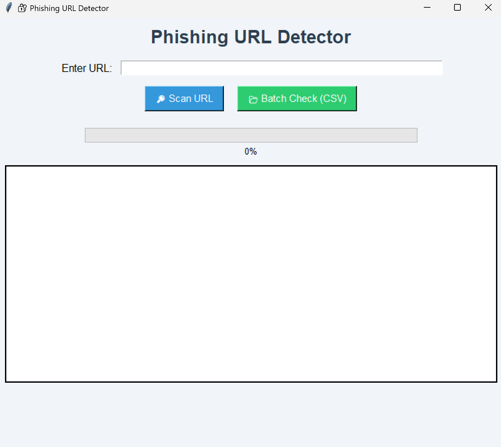

# 🛡️ Phishing URL Detector

A Python GUI app that detects phishing or malicious URLs using [VirusTotal](https://www.virustotal.com/) API and suspicious keyword analysis. Built with `Tkinter`, it supports both single and batch URL scanning, progress tracking, and logging to CSV.

---

## 📸 Screenshot



---

## 🚀 How to Run

### 1. Clone this repository

```bash
git clone https://github.com/vathsa-code/phishing-url-detector.git
cd phishing-url-detector
```

### 2. Install dependencies
```bash
pip install -r requirements.txt
```

### 3. Set up your API key
Create a file named .env in the project root and paste the following inside:
```env
API_KEY=your_virustotal_api_key_here
```
### You can get a free API key by signing up at VirusTotal.

### 4. Run the application
```bash
python main.py
```